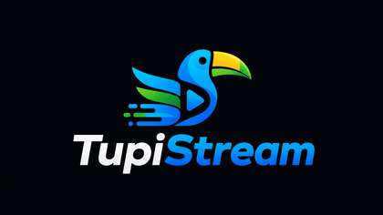

<p align="center">
  
</p>

# Tupi Stream 🇧🇷

> Seu agregador comunitário PT-BR para Stremio.

Tupi Stream reúne múltiplas fontes de filmes e séries em português brasileiro e organiza os resultados para uso no Stremio, com suporte a P2P e integração opcional com Real-Debrid.

## ✨ Destaques

- 🇧🇷 Foco em conteúdo dublado e dual áudio PT-BR
- 🔎 Agregação de múltiplas fontes
- ⚡ Consultas em paralelo
- 🧲 Reprodução P2P via infoHash
- ☁️ Integração opcional com Real-Debrid
- 🎞️ Suporte a filmes e séries
- 🐳 Docker pronto para uso
- 🧩 Arquitetura modular para novas fontes

## 📚 Fontes atuais

| Fonte | Tipo | Conteúdo |
|---|---|---|
| 🔥 Apache Torrent | Web scraping | Dublado / Dual Áudio |
| 🎬 Comando Filmes | Web scraping | Dublado / Dual Áudio |
| 🦁 MicoLeão Dublado | Web scraping | Foco em dublagem |
| 📺 HDR Torrent | Web scraping | 4K / HDR / Dolby Vision |
| 🌐 Brazuca Torrents | Addon proxy | Acervo brasileiro |
| 📚 Internet Archive | API pública | Domínio público / licenças abertas |

O Internet Archive funciona de forma diferente das demais fontes: utiliza a API pública do archive.org e é voltado principalmente a obras de domínio público ou disponibilizadas sob licenças abertas.

## 🚀 Instalação

1. Abra a página `/configure` da instância do Tupi Stream.
2. Informe seu token Real-Debrid, caso queira utilizar o serviço.
3. Escolha se também deseja exibir opções P2P.
4. Clique em **Instalar no Stremio**.

## ▶️ Modos de reprodução

### P2P gratuito

Sem token Real-Debrid, o addon envia o `infoHash` ao Stremio e o cliente tenta reproduzir o conteúdo pelo swarm.

### Real-Debrid

Com um token configurado, o addon consulta o serviço e prioriza opções disponíveis pelo Real-Debrid.

### Híbrido

É possível usar Real-Debrid e, ao mesmo tempo, manter opções P2P visíveis.

> A velocidade e a disponibilidade no modo P2P dependem de seeders, trackers, rede e suporte do cliente.

## 🔐 Segurança do token Real-Debrid

Novas instalações não colocam mais o token no caminho do manifest:

- o navegador envia o token uma única vez por `POST /api/configurations`;
- o servidor grava somente um payload criptografado;
- a URL instalada usa `/config/{id}/manifest.json`, com um ID aleatório;
- sessões `/play` guardam o ID da configuração, não o token;
- o payload expira conforme `CONFIG_TTL_SECONDS` (um ano por padrão).

Em cloud, defina `CONFIG_ENCRYPTION_KEY` com uma chave Fernet. Em instalação
local, se essa variável ficar vazia, o servidor cria `data/config.key`; por
isso o diretório `data/` precisa ser persistente. Perder ou trocar a chave
invalida as configurações já instaladas.

As rotas antigas com token no caminho continuam disponíveis somente para
compatibilidade. Reinstale o addon pela página `/configure` para migrar.

**Não compartilhe sua URL pessoal de manifest.** Ela não revela o token, mas
o ID funciona como autorização para usar aquela configuração. Compartilhe
apenas a página `/configure`.

Caso seu token tenha sido exposto, gere um novo token diretamente no Real-Debrid.


## 🛠️ Rodando localmente

### Pré-requisitos

- Python 3.11+
- Git
- Token Real-Debrid opcional

### Instalação

```bash
git clone https://github.com/Daniel-Castro754/TupiStream.git
cd TupiStream

python -m venv venv
```

Windows:

```bash
venv\Scripts\activate
```

Linux/macOS:

```bash
source venv/bin/activate
```

Instale as dependências:

```bash
pip install -r requirements.txt
cp .env.example .env
python -m app.main
```

Depois acesse:

```text
http://localhost:8000/configure
```

## 🐳 Docker

```bash
docker build -t tupistream .
docker run -p 8000:8000 -v $(pwd)/data:/app/data tupistream
```

## ☁️ Deploy

### Railway

1. Faça um fork do repositório.
2. Crie um projeto no Railway.
3. Conecte o repositório.
4. Configure `BASE_URL` com a URL pública da aplicação.
5. Faça o deploy usando o Dockerfile existente.

### Render

1. Faça um fork do repositório.
2. Crie um Web Service.
3. Escolha Docker como runtime.
4. Configure `BASE_URL`.
5. Utilize o `render.yaml` incluído no projeto.

## ⚙️ Variáveis de ambiente

| Variável | Padrão | Descrição |
|---|---|---|
| `PORT` | `8000` | Porta HTTP |
| `BASE_URL` | `http://localhost:8000` | URL pública do addon |
| `LOG_LEVEL` | `info` | Nível de log |
| `CACHE_TTL` | `3600` | Tempo de cache em segundos |
| `CACHE_DB_PATH` | `data/cache.db` | Banco SQLite de cache |
| `TMDB_API_KEY` | vazio | Melhora buscas de títulos PT-BR |

## 🧠 Arquitetura

```text
Stremio
  ↓
/stream/{type}/{imdb_id}
  ↓
StreamAggregator
  ├── SQLiteCache
  ├── ApacheTorrentScraper
  ├── ComandoFilmesScraper
  ├── MicoLeaoScraper
  ├── HDRTorrentScraper
  ├── BrazucaAddonScraper
  └── ArchiveOrgScraper
  ↓
RealDebridService (opcional)
  ↓
Ordenação e rotulagem dos resultados
  ↓
Stremio
```

## 🗂️ Estrutura

```text
TupiStream/
├── app/
│   ├── main.py
│   ├── manifest.py
│   ├── models/
│   ├── routes/
│   ├── scrapers/
│   └── services/
├── data/
├── .github/
├── Dockerfile
├── railway.json
├── render.yaml
└── requirements.txt
```

## 🤝 Contribuindo

Contribuições são bem-vindas.

Algumas formas de ajudar:

- adicionar novas fontes;
- melhorar os scrapers existentes;
- criar testes automatizados;
- melhorar cache e desempenho;
- revisar segurança e privacidade;
- melhorar documentação e experiência de configuração.

Consulte [`CONTRIBUTING.md`](CONTRIBUTING.md) antes de enviar alterações.

## ➕ Adicionando uma nova fonte

1. Crie `app/scrapers/nova_fonte.py` herdando `BaseScraper`.
2. Implemente `async search(query, imdb_id, type) -> list[TorrentResult]`.
3. Registre o scraper no agregador.
4. Teste falhas, timeouts e resultados duplicados antes de enviar um PR.

## ⚖️ Uso responsável

Tupi Stream é um projeto comunitário de software e não hospeda arquivos de mídia.

Cada usuário é responsável por utilizar o software de acordo com a legislação aplicável e por acessar apenas conteúdo para o qual possua autorização ou direito de acesso.

## 📄 Licença

MIT
